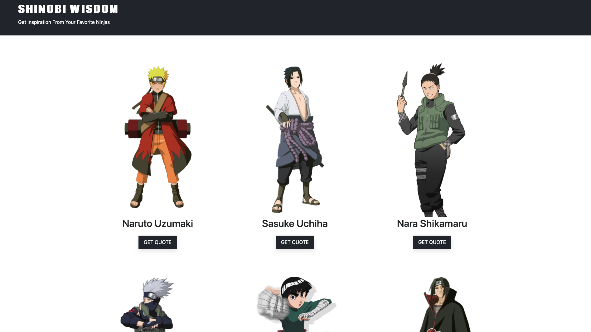
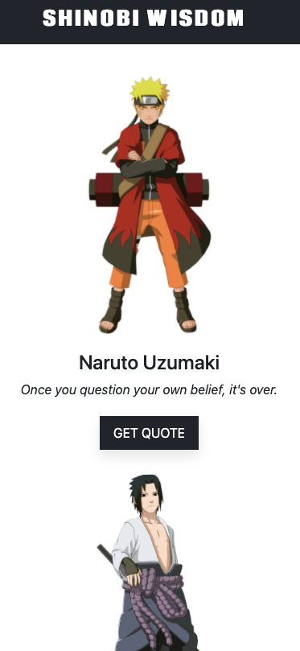

# Shinobi Wisdom

This responsive website was built using some Bootstrap and the [Animechan](https://animechan.vercel.app/) API. It allows the user to get a random quote from six different characters from the anime Naruto. 
As far as I am aware the Animechan API doesn't have an endpoint for a random quote from a specific character. To solve this problem, I added in a randomize function for each character's quotes. 

## Randomizer Function

``` javascript
function randomizeNaruto(quoteArray) {
        const random = Math.floor(Math.random() * quoteArray.length);
        const narutoQuote = document.querySelector('#narutoQuote');
        narutoQuote.innerText = quoteArray[random].quote;
    }
```

This function took the array from each character's endpoint and returned a random quote. Each time the corresponding button is pressed a fetch request will run and repeat the process. I couldn't figure out how to have the same functionality without creating functions for each character, so there is a lot of repetition in the code. 

## Screenshots




